# 🌱 NamuWiki Farm  
**IoT 기기 연동 & 스마트팜 SNS 모바일 앱 풀스택 개발**  
*(Python, Java/Spring Boot, React Native + Expo)*  

---

## 📌 프로젝트 개요  

안녕하세요! NamuWiki Farm은 **스마트팜 관리와 SNS를 결합한 IoT 기반 풀스택 플랫폼**입니다.  
**농장 모니터링부터 소비자와의 소통까지** 모두 가능한 서비스를 구현했습니다.  

- 🤖 **IoT 기기 자동제어 시스템** (Python, Raspberry Pi)  
- 🖥️ **API 서버** (Java/Spring Boot + MariaDB)  
- 📱 **모바일 앱** (React Native + Expo)  

---

## 🔗 레포지토리  

| 구분 | 기술 스택 | 링크 |
|------|-----------|------|
| 📱 App | React Native + Expo | [namuwiki-app](https://github.com/james14kr/namuwiki-app.git) |
| 🖥️ Backend | Java/Spring Boot + MariaDB | [namuwiki-back](https://github.com/james14kr/namuwiki.git) |
| 🤖 IoT 제어 | Python (Raspberry Pi) | [namuwiki-python](https://github.com/james14kr/namuwiki-IoT.git) |

---

## 🌿 주요 기능  

✅ **IoT 기기 실시간 모니터링 및 자동/수동 제어**  
✅ **스마트팜 SNS (게시글, 댓글, 좋아요, 팔로우, 실시간 DM 채팅)**  
✅ **농장주 / 일반 사용자 역할 분리 구조**  
✅ **AWS S3 이미지 업로드 및 날씨 정보 연동**  

---

## 📱 앱 시연  

| 기능 | 미리보기 |
|------|----------|
| 🔐 로그인 | 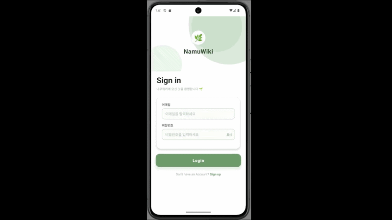|
| 🏠 홈 피드 (무한스크롤) |  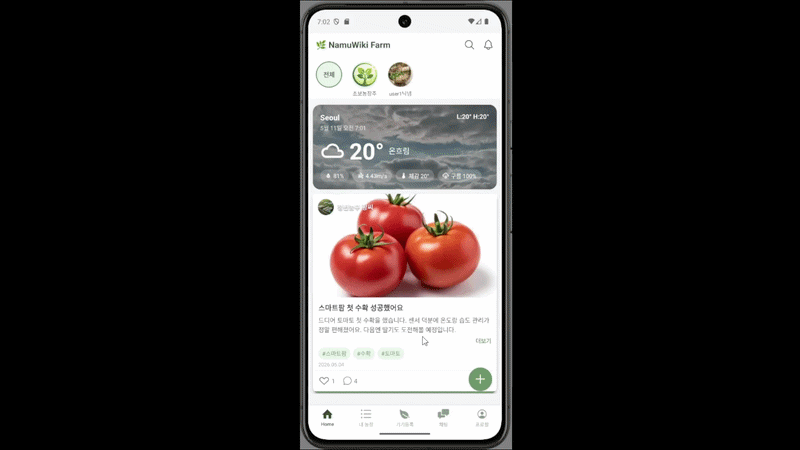 |
| 🌡️ 센서 데이터 모니터링 |  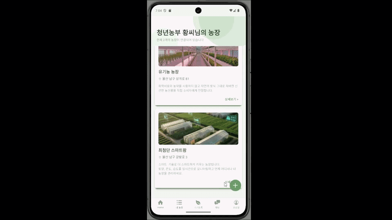 |
| 👨‍🌾 일반사용자 농작물 건강도 조회 |  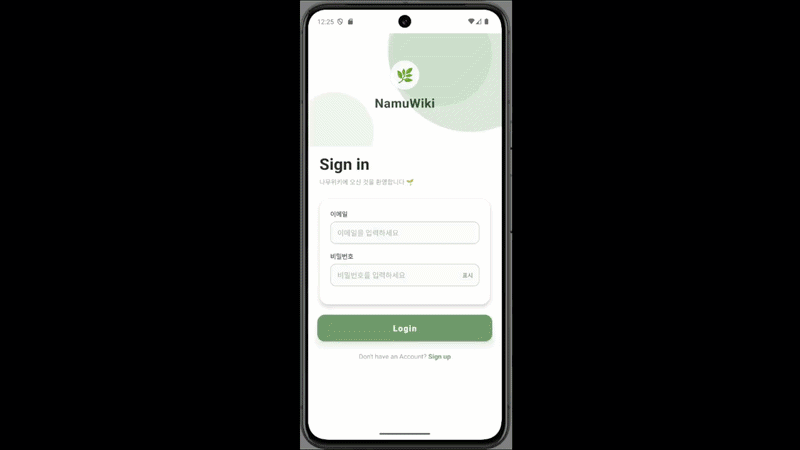 |
| ⚙️ 임계값 변경 |  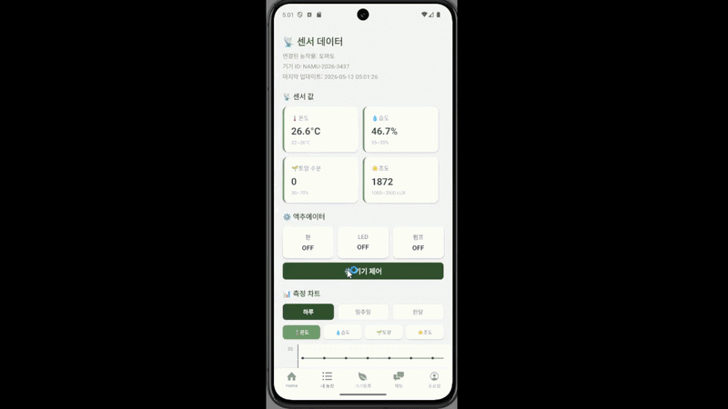 |
| 🟢 기기 수동ON |  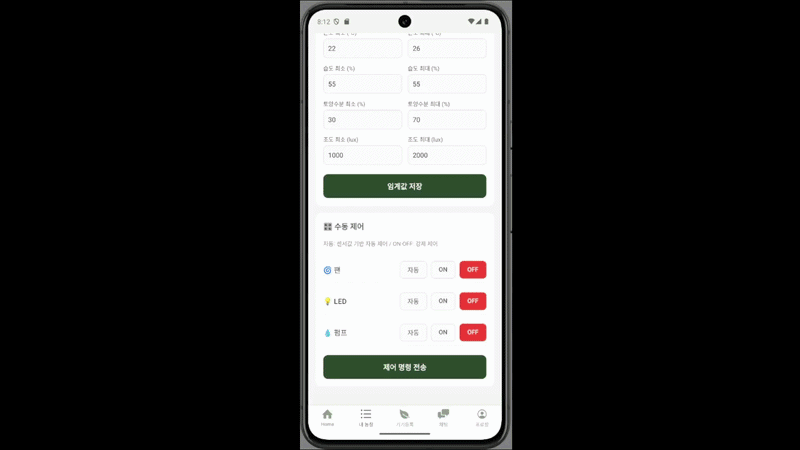 |
| 🔴 기기 수동OFF |  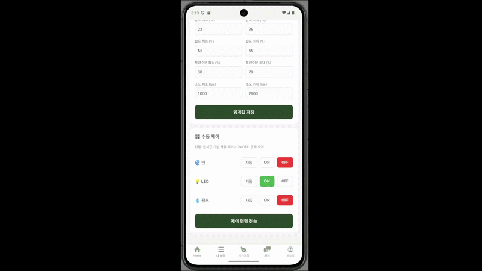 |
| 🛠 기기 자동 제어 |  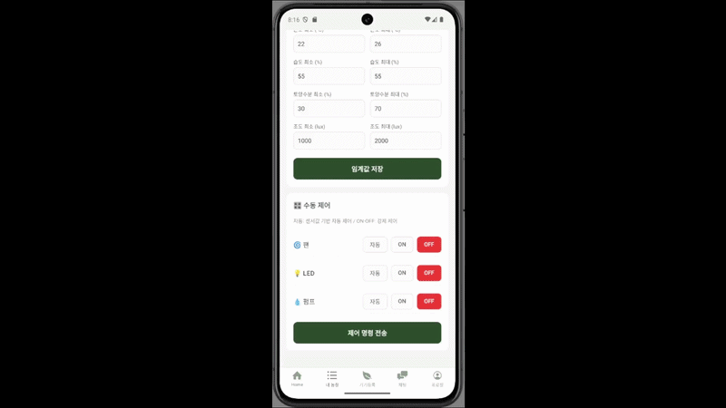 |
| 💬 실시간 DM 채팅 |  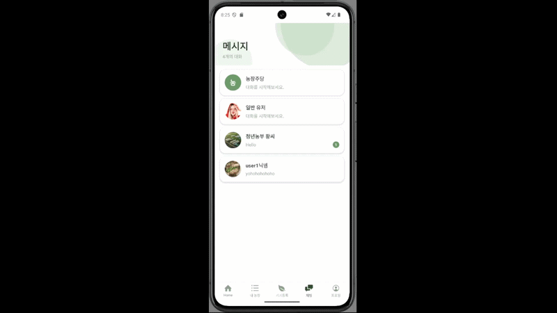 |
| 👤 프로필 |  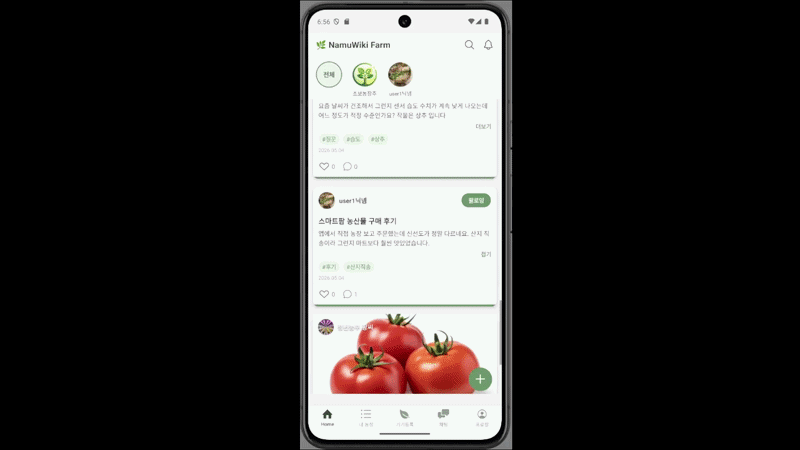 |
| 👤 팔로우 |  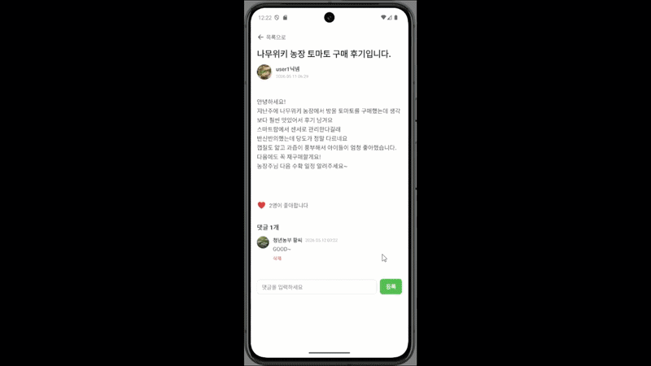 |

---

## 🛠️ 사용 기술  

| 분야 | 기술 스택 |
|------|-----------|
| **모바일 앱** | React Native, Expo SDK 54, TypeScript |
| **라우팅** | Expo Router 6 (파일 기반 라우팅) |
| **서버 상태 관리** | TanStack Query v5 |
| **실시간 채팅** | WebSocket + STOMP (`@stomp/stompjs`) |
| **인증** | JWT + expo-secure-store + jwt-decode |
| **이미지 업로드** | AWS S3 Presigned URL + expo-image-manipulator |
| **날씨** | expo-location + OpenWeatherMap API |
| **백엔드** | Java, Spring Boot, MariaDB, MyBatis |
| **IoT 제어** | Python, Raspberry Pi |
| **협업 도구** | GitHub, Notion |

---

## 🔍 프로젝트 특징  

- 🌿 **실제 IoT 기기 제어 경험**  
  - 온도·습도·조도·토양수분 센서를 통한 실시간 데이터 측정  
  - 자동/수동 모드 전환으로 팬·LED·펌프 제어  
  - DB OVERRIDE 컬럼을 활용한 앱 → 서버 → Python → 하드웨어 제어 흐름 구현  

- 📱 **역할 기반 모바일 앱 설계**  
  - Expo Router 파일 기반 라우팅으로 농장주(farmer-tabs)와 일반 사용자(user-tabs) 완전 분리  
  - JWT 토큰의 role 값으로 로그인 시 자동 분기 처리  

- 💬 **SNS + 실시간 채팅 통합**  
  - 게시글·댓글·좋아요·팔로우·홈 피드 무한스크롤 구현  
  - WebSocket STOMP 기반 실시간 DM 채팅  

---

## 👥 팀원  

| 이름 | 담당 역할 |
|------|-----------|
| 황민서 | 모바일 앱 전반 (네비게이션 구조, 농장·기기·센서·팔로우·프로필·UI) |
| 김유정 | 로그인 / DM 실시간 채팅 |
| 김재근 | 게시글 / 홈 피드 |

---

## 💡 느낀 점  

이 프로젝트를 통해 **단순한 앱 개발을 넘어 IoT 기기 제어와 데이터 통신**까지 경험할 수 있었습니다.  
특히 앱 버튼 하나로 DB를 거쳐 라즈베리파이의 팬과 LED가 실제로 동작할 때,  
"내 코드가 실제 기기를 움직인다"는 성취감을 느꼈습니다.  
JWT 인코딩 오류, S3 업로드 방식, pymysql autocommit 등 예상치 못한 문제를 직접 해결하면서  
**디버깅 능력과 전체 시스템을 보는 시각**을 키운 경험이었습니다.  
